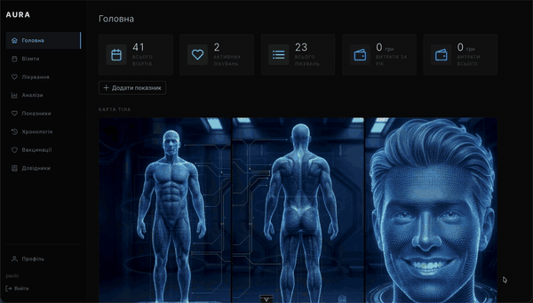

# MedTracker

Personal medical records tracker with an interactive body map, visit history, treatment monitoring, lab results, push notification reminders, and PWA support. Built with FastAPI and Vue.js. Installable on iOS and Android without app store. All UI labels in Ukrainian.

📖 [Documentation (Notion)](https://www.notion.so/Aura-Medical-33bfc4c0841280d0a57cdd4d5df8d9c7)

## Demo




## Features

- **Interactive Body Map** — sex-aware anatomical visualization (front, back, face) with 40+ clickable hotspots mapped to body regions. Highlights areas with active treatments, supports click-to-filter visits by region
- **Visit Records** — track doctor visits with date, specialty, procedure, clinic, city, body region, comments, and attached documents
- **Treatment Tracking** — medication courses with automatic status calculation (active/completed) based on start date and duration
- **Lab Results & Biomarker Trends** — blood tests with reference ranges, out-of-range highlighting, and trend charts per biomarker over time
- **Health Metrics / Vitals Journal** — track heart rate, blood pressure, temperature, weight and other metrics with trend charts and reference range annotations
- **Vaccination Records** — immunization history with dose tracking, next-due-date alerts, and document attachments
- **Calendar View** — monthly/weekly calendar (FullCalendar) showing past visits and future appointments with treatments as diagonal-striped date ranges. Click a date to create a visit via side panel, click an event for a popover with details and .ics export. Replaces the former Timeline view
- **Weather & Environment** — real-time weather, UV index, air quality (AQI with 8 pollutants), geomagnetic storms (Kp index with health impact), and circadian light assessment — powered by [SkyPulse](https://pypi.org/project/skypulse-weather/) by Pavlo Olshansky. Dashboard card opens a detail page with forecast charts, color-coded risk levels, and tooltips explaining every indicator
- **Dashboard** — summary cards, recent visits, active treatments, expenses, weather at a glance, and body map overview
- **Health Profile** — demographics, blood type, allergies, chronic conditions, emergency contact, weather city with IP auto-detection
- **Document Management** — upload and preview medical documents (images, PDFs) attached to visits and vaccinations
- **Reference Data** — manage doctor specialties, procedures, clinics, cities, biomarker references, and metric types with inline CRUD
- **Global Search** — Ctrl+K / Cmd+K opens a Spotlight-style search dialog to find any record across visits, treatments, lab results, and vaccinations. Case-insensitive Cyrillic matching (ICU collation), results grouped by type with match highlighting, full keyboard navigation (arrows + Enter), and click-to-navigate. Search icon also available in the sidebar
- **Keyboard Shortcuts** — Escape closes modals/drawers with dirty-form confirmation ("Discard unsaved changes?"), Enter submits forms from single-line inputs, Ctrl+Enter submits from textareas (with button hint), Enter confirms dialogs
- **Filtering & Search** — visits filterable by date range, clinic, city, procedure, doctor specialty; treatments by status
- **Push Notification Reminders** — Web Push via VAPID for receiving reminders on phone 1 day and 1 hour before visits, treatment starts, and vaccination due dates. Jobs persist across restarts (PostgreSQL-backed APScheduler). Multi-worker safe via advisory locks (exactly-once execution). Works with browser closed on Android; on iOS requires PWA installation. Device-specific setup guide auto-detects platform
- **Progressive Web App (PWA)** — installable on iOS (Safari → Add to Home Screen) and Android (Chrome → Install app) without app store. Offline shell caching via service worker, standalone mode without browser chrome
- **Dark / Light Theme** — toggle between dark, light, and system-auto modes. Persists across sessions, no flash on page reload. All components adapted via CSS variables
- **Responsive Mobile Design** — drawer sidebar with hamburger menu on tablets/phones, column hiding in tables, stacked form layouts, scrollable charts, 44px touch targets
- **Health Check Endpoints** — `/health` liveness and `/health/ready` readiness probes for Docker healthchecks and monitoring

## Tech Stack

| Layer | Technologies |
|-------|-------------|
| **Frontend** | Vue.js 3, TypeScript, PrimeVue 4.5, Pinia, Vue Router, Vite 7, Chart.js |
| **Backend** | Python 3.14+, FastAPI, SQLAlchemy 2.0 (async), Pydantic v2, Alembic |
| **Database** | PostgreSQL 15+, psycopg v3 (async) |
| **Auth** | JWT tokens (PyJWT), bcrypt password hashing |
| **Calendar** | FullCalendar 6 (Vue 3 adapter), icalendar (Python .ics generation) |
| **Push** | pywebpush, VAPID (auto-generated), APScheduler (PostgreSQL-backed persistence, advisory locks) |
| **PWA** | vite-plugin-pwa, Workbox, service worker |
| **Weather** | [SkyPulse](https://pypi.org/project/skypulse-weather/) — UV, AQI, geomagnetic storms, circadian light |
| **Testing** | pytest, pytest-asyncio (127 tests) |
| **Infra** | Docker Compose, GitHub Actions CI |

## Architecture

```
backend/
  app/
    api/              # Route handlers (auth, visits, treatments, calendar, push, notifications, search, health, etc.)
    application/      # Application services, commands, push scheduler
    domain/           # Domain entities, value objects, repository interfaces, exceptions
    infrastructure/   # Database engine, ORM models, repositories, JWT, VAPID manager, scheduler
      models/         # SQLAlchemy ORM models (12 models)
      repositories/   # Repository implementations
    schemas/          # Pydantic request/response schemas
  alembic/            # Database migrations (11 migrations)
  tests/              # pytest test suite (127 tests)

frontend/
  public/
    icons/            # PWA icons (72, 192, 512, maskable, apple-touch)
    sw-push.js        # Push notification service worker handler
  src/
    views/            # Page components (18 pages, 28 routes)
    components/       # AppLayout, BodyMap, Calendar, Charts, GlobalSearch, ThemeToggle, NotificationBell, PushSetupGuide
    composables/      # useTheme, useOnlineStatus, usePushNotifications, useCalendarLabels, useUrlFilters, useGlobalSearch, useFormDirtyCheck, useEnterSubmit
    api/              # Axios client with JWT interceptor
    stores/           # Pinia state management
    router/           # Vue Router with auth guards
    types/            # TypeScript interfaces and payload types
    utils/            # Date formatting, chart setup
```

## Getting Started

### Quick Start with Docker

**Prerequisites:** Docker Desktop

```bash
git clone
make docker-up        # Start PostgreSQL + backend + frontend
make docker-seed      # Create default user (admin / admin)
```

Open `http://localhost:5173` and log in with `admin` / `admin`.

### Local Development

**Prerequisites:** Python 3.14+, Node.js 20+, PostgreSQL 15+

```bash
# Clone and install
git clone
make install

# Configure environment
cp backend/.env.example backend/.env
# Edit backend/.env — set SECRET_KEY (required) and other settings

# Create database, run migrations, create user
make db-create
make db-migrate
make seed             # Creates admin/admin user

# Start development servers
make dev
```

Backend runs at `http://localhost:8000` (Swagger UI at `/docs`), frontend at `http://localhost:5173`.

## Available Commands

```bash
make dev              # Start backend + frontend
make dev-pwa          # Production build + backend (for testing push/PWA)
make backend          # Start backend only
make frontend         # Start frontend only
make seed             # Create default admin/admin user
make test             # Run tests
make lint             # Lint frontend
make build            # Production frontend build
make db-migrate       # Run Alembic migrations
make db-revision msg="description"  # Generate new migration
make backup           # Backup PostgreSQL database

# Docker
make docker-up        # Start dev environment (PostgreSQL + backend + frontend)
make docker-down      # Stop Docker services
make docker-seed      # Create admin user in Docker
make docker-logs      # Tail Docker logs
```

### Testing Push Notifications

Push requires a production frontend build (service worker is not active in dev mode):

```bash
# Set TEST_MODE=true in backend/.env
make dev-pwa
# Open http://localhost:5173, enable notifications in Profile
# Click "Test push" button on dashboard — notification in 30 seconds
```

## License

This is a personal project actively used. The source code is shared for portfolio and reference purposes. All rights reserved.
